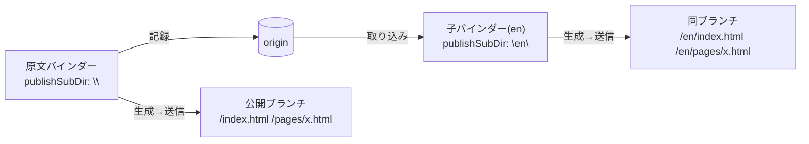

# 公開サイトの国際化（検討メモ）

公開サイトを ja / en の2言語で運用するための設計案を比較したもの。
**まだ何も決めていない。実装もしていない。** 案を捨てないために書き残す。

出発点は「バインダーを2つ作り、公開先URLを `/ja` `/en` で分ける」という話だったが、
運用コストが高いのではないかという懸念から、他の設計を検討している。

## 現状: なぜ「バインダー2つ」になるのか

公開出力が **1バインダー = 1サイト**に固定されているため。

- 出力はフラット: `docs/index.html` / `docs/pages/{alias}.html` / `docs/images/{alias}.svg`
  （[fs/path.go](../fs/path.go) `HTMLFile` / `svgFile`）
- `index.html` は1つだけ。言語別トップが作れない
- alias はバインダー内で単一の名前空間（重複チェックのみ）
- 「下層を含め公開」(`publishSubtree`) はサブツリーを `docs/` へ**追加生成**するだけで、
  別サイトを作る機能ではない
- `PushDocs` は `docs/` 全体を1つの subDir へ送る

つまり言語を分ける切れ目がバインダー境界にしか無い。

### 既に入っているもの

コミット `ac0d6adc`「feat: PushDocs にサブディレクトリ公開機能を追加」で、
**複数バインダーから同一ブランチの異なるパスへ公開する**仕組みは実装済み。

- [fs/git.go](../fs/git.go) `PushDocs(remote, branch, subDir, info)` —
  subDir 指定時は公開ブランチを一時リポジトリへ fetch し、
  **そのサブディレクトリだけ削除**してから force push する。他言語の出力は保持される
- 設定は `binder.json` の `publishBranch` / `publishSubDir`（[fs/meta.go](../fs/meta.go)）
- UI は送信フォームの「公開先ブランチ名」＋「サブディレクトリ」
  （[SendForm.jsx](../_cmd/binder/frontend/src/dialogs/SendForm.jsx)）

**どの案を採っても、この送信の仕組みはそのまま使える。**

## 案A: バインダー2つ（現状の延長）

原文用と翻訳用に独立したバインダーを作り、`publishSubDir` を `""` と `en` にする。

コード変更ゼロで**今日できる**。ただし維持コストが高い。

1. 図・アセットの二重管理（バイナリなのでリポジトリも太る）
2. テンプレート・CSS の二重管理（デザイン変更のたびに2箇所同期）
3. ツリー構造の二重管理
4. **alias の対応付けを人力で維持**（`/pages/x.html` ↔ `/en/pages/x.html` を揃える）
5. 記録・生成・送信が毎回2回

4 が特にまずい。片方だけ alias を変えると言語切替リンクが黙って壊れる。
さらに「原文が更新されたので翻訳が古い」を検出する手段が**原理的に無い**
（2つのバインダーの間に関係が無いため）。

## 整理: 言語は「構造の軸」ではなく「バージョンの軸」

案を評価する軸として、これが効く。

structures（ツリー）は**コンテンツの構造**を表す。
`ja版のGetting Started` と `en版のGetting Started` は、構造上は同じ1つのノードであり、
別のノードではない。これをツリーの親子で表現すると、ツリーが「構造 × 言語」の2次元になり、
`childNotes` / `breadcrumb` / `doctor` / 検索 のすべてに「言語を無視して辿る」特別扱いが要る。

一方 **バージョン軸はこのアプリに既にある。git である。**

この視点で見ると、案D（構造に入れる）と案E（git に置く）の性格の違いが説明できる。

## 案D: structures に `lang` を持たせる

原文ノートの子として、`lang` を持つ翻訳ノートをぶら下げる。

| | 原文ノート | 翻訳ノート（バリアント） |
|---|---|---|
| `parent_id` | ツリー上の親 | **原文ノートのID** |
| `alias` | `getting-started` | **空**（原文から継承） |
| `lang` | 空（既定言語） | `en` |
| 実体 | `notes/{id}.md` | `notes/{id}.md`（別ID・別ファイル） |

alias を継承するので `/pages/getting-started.html` と `/en/pages/getting-started.html` が
**構造的に必ず一致する**。揃える作業が消えるのが最大の利点。

生成は `binder.json` の言語リスト（例 `[{code:"ja",dir:""},{code:"en",dir:"en"}]`）でループし、
`docs/en/pages/*.html` を出す。**画像・図・CSS は `docs/images` `docs/assets` を共有**できる。

### 効くところ

- alias 対応が構造保証。同期作業が発生しない
- 図・アセット・テンプレート・CSS・プラグインを共有。実体が重複しない
- 記録・生成・送信が1回
- 「未翻訳一覧」を自然に出せる（`en` バリアントを持たないノートを列挙するだけ）
- **翻訳の陳腐化検出ができる**（原文の `updated_date` > 翻訳の `updated_date`）
- 同じ仕組みを `diagrams` へ横展開できる（図中の文字を翻訳したくなったとき）

### 引っかかるところ

- 上で書いたとおり、**ツリーに無理な次元を持ち込む**。実装が広く波及する
  1. `structures.lang` 追加 + バインダーレベルマイグレーション + DAO再生成
     （カラム追加自体は前例あり: 0.9.4 の `assets.mime`）
  2. [fs/path.go](../fs/path.go) の `HTMLFile()` 等に言語ディレクトリを通す ← 署名変更の波及が一番大きい
  3. `relativePrefix()` の深さ対応（後述）
  4. `childNotes` / `breadcrumb` / `latestNotes` の言語フォールバック（[html_func.go](../html_func.go)）
  5. 公開処理の言語ループ、`UnpublishAll` / `RenamePublishedNote` / `RunDoctor` の追随
  6. UI: ノートの言語タブ、未翻訳一覧、言語設定

## 案E: 翻訳ブランチ＝子バインダー

言語は git の軸に置く。**原文バインダーのクローン**を翻訳用の子バインダーとする。

- 子バインダー = 原文バインダーを remote に持つローカルクローン（`lang/en` ブランチ）
- `notes/{id}.md` は**同じID・同じファイル名のまま中身だけ翻訳**する
- `structures.csv` は共有されるので、**alias・ツリー・seq が構造的に一致する**
- `binder.json` はブランチごとに違うので、`publishSubDir` ・サイト名・detail が自然に言語別になる

翻訳作業の導線:
**取り込み → 変わったノートがコンフリクトとして出る → 訳を更新して記録 → 生成 → `en/` へ送信**

### 部品はほぼ揃っている

| 必要なもの | 現状 |
|---|---|
| 子バインダーの作成 | `fs.Clone(dir, url, branch, info)`（[fs/fs.go](../fs/fs.go)）。URL にローカルパスを渡せる |
| 原文の更新を持ち込む | 「取り込み」（`MergeFromRemote` / `MergeFromLocal`） |
| structures.csv の同期 | **行単位の3-wayマージ実装済み**（[fs/merge_csv.go](../fs/merge_csv.go) `mergeRows`）。ツリー変更・alias変更・新規ノートが伝播する |
| 何が変わったかの提示 | マージログノートの自動生成（[merge_log.go](../merge_log.go)） |
| マージ後の破損復旧 | `ReconcileMergedTree()`（[merge_reconcile.go](../merge_reconcile.go)） |
| 言語別URLへの送信 | `publishSubDir`（実装済み） |

**「翻訳が古い」がコンフリクトそのものとして出る**のが効く。
原文が更新された翻訳済みファイルは必ずコンフリクトするので、
検出機構を作らなくても取りこぼさない。新規ノートはコンフリクトせずそのまま入る＝未翻訳として残る。

### 足りないもの（小さい）

- `binder.json` に `lang` と `baseBinder`（表示・導線用のメタ。生成ロジックには不要）
- `<html lang>` をそこから出す（現状 `layout.tmpl` は `lang="en"` 固定）
- 「言語バインダーを作成」の導線（Clone + binder.json 書き換え）

**スキーマ変更なし・生成系の改修なし**で済む。案Dとは実装規模が一桁違う。

### 引っかかるところ

- **ディスクは倍**。図・アセットも複製され、公開物も `/en/images/` が二重になる
- 原文更新のたびに翻訳済みファイルがコンフリクトする。解決は**ファイル単位の ours/theirs/both**
  しかないので、「原文のこの段落だけ訳し直す」は手作業（差分はマージログで見える）
- アプリとしての「未翻訳一覧」は出ない
- 子バインダーが単体で完結する代わりに、共通アセットを共有する余地が無い

## 比較

| | 案A: バインダー2つ | 案D: structures.lang | 案E: 翻訳ブランチ |
|---|---|---|---|
| 実装量 | ゼロ | 大 | 小 |
| alias の一致 | 人力 | 構造保証 | 構造保証（マージ） |
| 図・アセット | 二重 | **共有** | 二重 |
| テンプレート・CSS | 二重 | 共有 | 二重（マージで同期） |
| 陳腐化検出 | **不可能** | `updated_date` 比較 | コンフリクトとして出る |
| 未翻訳一覧 | 不可 | 出せる | マージログ経由のみ |
| 送信回数 | 2回 | 1回 | 2回 |
| ツリーへの侵襲 | なし | **あり（2次元化）** | なし |

**案Dは重複を無くす。案Eは重複を git に管理させる。** これが取引の本質。

## どの案でも要る共通の小改修

案の選択と独立に価値があり、単独で入れられる。

- **`relativePrefix()` の深さ対応** — [html_wrapper.go](../html_wrapper.go) は
  index 以外を一律 `"../"` としている。`docs/en/pages/` のような階層が1段でも増えると、
  CSS・画像・ホームへの相対リンクが全部壊れる。
  URL生成は `convertURL() = relativePrefix() + publishRelPath()` に一元化されているので、
  直す場所自体は1箇所
- **`tempNote` に `Alias` を追加** — [html.go](../html.go) の `tempNote` に alias が無いため、
  `layout.tmpl` に**言語切替リンクと `hreflang` を汎用に書けない**。
  `{{.Note.Alias}}` があれば1行で書ける
- **`<html lang>` を設定から出す** — 現状ハードコード

## 未検討の論点

1. **翻訳しないものの扱い** — 図や画像は多くが言語非依存。案Eだと全部複製される。
   「共通アセットは原文側を参照する」を許すと、子バインダーが単体で完結しなくなる
2. **原文で alias を変えたとき** — 案Eではマージで伝播するが、
   翻訳側の公開済みHTMLのリネーム（`RenamePublishedNote`）が正しく走るかは要確認
3. **3言語目** — 案Eは子が増えるだけ、案Dはリストに足すだけ。ここは差がつかない
4. **ノート単位で「この言語には出さない」** — どちらの案でも表現手段が要る
5. **alias に `/` を含める抜け道** — `copyReader` が `mkdir` するため
   `docs/pages/en/x.html` は生成できてしまうが、`relativePrefix()` が固定なので
   リンクが壊れる。深さ対応を入れるまでは**やってはいけない**

## スキルへの反映

`docs/skills/binder-organize/SKILL.md` に国際化の節を足す話が出ているが、
**書く内容が案によって全く変わる**（案A/Eなら「クローンと取り込みの運用」、
案Dなら「翻訳バリアントの作り方」）。方式が決まってから書く。

## 参照

- 送信: [fs/git.go](../fs/git.go) `PushDocs` / [binder.go](../binder.go) `PushDocs`
- 公開パス: [fs/path.go](../fs/path.go) `HTMLFile` / `svgFile` / `publicMetaFilePath`
- URL生成: [html_wrapper.go](../html_wrapper.go) `relativePrefix` / `convertURL`
- テンプレートに渡るデータ: [docs/publish-design.md](publish-design.md)
- マージ: [fs/merge.go](../fs/merge.go) / [fs/merge_csv.go](../fs/merge_csv.go) / [merge_reconcile.go](../merge_reconcile.go)
- メタ: [fs/meta.go](../fs/meta.go) `BinderMeta`
