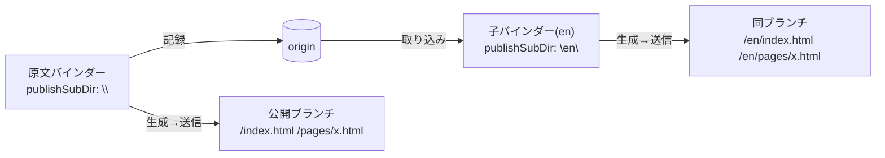

# 公開サイトの国際化（検討メモ）

公開サイトを ja / en の2言語で運用するための設計案を比較したもの。
**まだ何も決めていない。実装もしていない。** 案を捨てないために書き残す。
現時点の第一候補は**案F**、繋ぎとして動かせるのが**案E**。

出発点は「バインダーを2つ作り、公開先URLを `/ja` `/en` で分ける」という話だったが、
運用コストが高いのではないかという懸念から、他の設計を検討している。

## 現状: なぜ「バインダー2つ」になるのか

公開出力が **1バインダー = 1サイト**に固定されているため。

- 出力はフラット: `docs/index.html` / `docs/pages/{alias}.html` / `docs/images/{alias}.svg`
  （[fs/path.go](../fs/path.go) `HTMLFile` / `svgFile`）
- `index.html` は1つだけ。言語別トップが作れない
- alias はバインダー内で単一の名前空間（重複チェックのみ）
- 「下層を含め公開」(`publishSubtree`) はサブツリーを `docs/` へ**追加生成**するだけで、
  別サイトを作る機能ではない
- `PushDocs` は `docs/` 全体を1つの subDir へ送る

つまり言語を分ける切れ目がバインダー境界にしか無い。

### 既に入っているもの

コミット `ac0d6adc`「feat: PushDocs にサブディレクトリ公開機能を追加」で、
**複数バインダーから同一ブランチの異なるパスへ公開する**仕組みは実装済み。

- [fs/git.go](../fs/git.go) `PushDocs(remote, branch, subDir, info)` —
  subDir 指定時は公開ブランチを一時リポジトリへ fetch し、
  **そのサブディレクトリだけ削除**してから force push する。他言語の出力は保持される
- 設定は `binder.json` の `publishBranch` / `publishSubDir`（[fs/meta.go](../fs/meta.go)）
- UI は送信フォームの「公開先ブランチ名」＋「サブディレクトリ」
  （[SendForm.jsx](../_cmd/binder/frontend/src/dialogs/SendForm.jsx)）

**どの案を採っても、この送信の仕組みはそのまま使える。**

## 案A: バインダー2つ（現状の延長）

原文用と翻訳用に独立したバインダーを作り、`publishSubDir` を `""` と `en` にする。

コード変更ゼロで**今日できる**。ただし維持コストが高い。

1. 図・アセットの二重管理（バイナリなのでリポジトリも太る）
2. テンプレート・CSS の二重管理（デザイン変更のたびに2箇所同期）。
   しかも**単純コピーでは動かない**（後述「テンプレート内の文言をどうするか」）
3. ツリー構造の二重管理
4. **alias の対応付けを人力で維持**（`/pages/x.html` ↔ `/en/pages/x.html` を揃える）
5. 記録・生成・送信が毎回2回

4 が特にまずい。片方だけ alias を変えると言語切替リンクが黙って壊れる。
さらに「原文が更新されたので翻訳が古い」を検出する手段が**原理的に無い**
（2つのバインダーの間に関係が無いため）。

## 整理: 言語は「構造の軸」ではなく「バージョンの軸」

案を評価する軸として、これが効く。

structures（ツリー）は**コンテンツの構造**を表す。
`ja版のGetting Started` と `en版のGetting Started` は、構造上は同じ1つのノードであり、
別のノードではない。これをツリーの親子で表現すると、ツリーが「構造 × 言語」の2次元になり、
`childNotes` / `breadcrumb` / `doctor` / 検索 のすべてに「言語を無視して辿る」特別扱いが要る。

一方 **バージョン軸はこのアプリに既にある。git である。**

この視点で見ると、案D（構造に入れる）と案E（git に置く）の性格の違いが説明できる。

## 案D: structures に `lang` を持たせる

> **この案は案F（後述）に置き換えられた。** 発想の経緯として残す。

原文ノートの子として、`lang` を持つ翻訳ノートをぶら下げる。

| | 原文ノート | 翻訳ノート（バリアント） |
|---|---|---|
| `parent_id` | ツリー上の親 | **原文ノートのID** |
| `alias` | `getting-started` | **空**（原文から継承） |
| `lang` | 空（既定言語） | `en` |
| 実体 | `notes/{id}.md` | `notes/{id}.md`（別ID・別ファイル） |

alias を継承するので `/pages/getting-started.html` と `/en/pages/getting-started.html` が
**構造的に必ず一致する**。揃える作業が消えるのが最大の利点。

生成は `binder.json` の言語リスト（例 `[{code:"ja",dir:""},{code:"en",dir:"en"}]`）でループし、
`docs/en/pages/*.html` を出す。**画像・図・CSS は `docs/images` `docs/assets` を共有**できる。

### 効くところ

- alias 対応が構造保証。同期作業が発生しない
- 図・アセット・テンプレート・CSS・プラグインを共有。実体が重複しない
- 記録・生成・送信が1回
- 「未翻訳一覧」を自然に出せる（`en` バリアントを持たないノートを列挙するだけ）
- **翻訳の陳腐化検出ができる**（原文の `updated_date` > 翻訳の `updated_date`）
- 同じ仕組みを `diagrams` へ横展開できる（図中の文字を翻訳したくなったとき）

### 引っかかるところ

- 上で書いたとおり、**ツリーに無理な次元を持ち込む**。実装が広く波及する
  1. `structures.lang` 追加 + バインダーレベルマイグレーション + DAO再生成
     （カラム追加自体は前例あり: 0.9.4 の `assets.mime`）
  2. [fs/path.go](../fs/path.go) の `HTMLFile()` 等に言語ディレクトリを通す ← 署名変更の波及が一番大きい
  3. `relativePrefix()` の深さ対応（後述）
  4. `childNotes` / `breadcrumb` / `latestNotes` の言語フォールバック（[html_func.go](../html_func.go)）
  5. 公開処理の言語ループ、`UnpublishAll` / `RenamePublishedNote` / `RunDoctor` の追随
  6. UI: ノートの言語タブ、未翻訳一覧、言語設定

## 案E: 翻訳ブランチ＝子バインダー

言語は git の軸に置く。**原文バインダーのクローン**を翻訳用の子バインダーとする。

- 子バインダー = 原文バインダーを remote に持つローカルクローン（`lang/en` ブランチ）
- `notes/{id}.md` は**同じID・同じファイル名のまま中身だけ翻訳**する
- `structures.csv` は共有されるので、**alias・ツリー・seq が構造的に一致する**
- `binder.json` はブランチごとに違うので、`publishSubDir` ・サイト名・detail が自然に言語別になる



翻訳作業の導線:
**取り込み → 変わったノートがコンフリクトとして出る → 訳を更新して記録 → 生成 → `en/` へ送信**

### 部品はほぼ揃っている

| 必要なもの | 現状 |
|---|---|
| 子バインダーの作成 | `fs.Clone(dir, url, branch, info)`（[fs/fs.go](../fs/fs.go)）。URL にローカルパスを渡せる |
| 原文の更新を持ち込む | 「取り込み」（`MergeFromRemote` / `MergeFromLocal`） |
| structures.csv の同期 | **行単位の3-wayマージ実装済み**（[fs/merge_csv.go](../fs/merge_csv.go) `mergeRows`）。ツリー変更・alias変更・新規ノートが伝播する |
| 何が変わったかの提示 | マージログノートの自動生成（[merge_log.go](../merge_log.go)） |
| マージ後の破損復旧 | `ReconcileMergedTree()`（[merge_reconcile.go](../merge_reconcile.go)） |
| 言語別URLへの送信 | `publishSubDir`（実装済み） |

**「翻訳が古い」がコンフリクトそのものとして出る**のが効く。
原文が更新された翻訳済みファイルは必ずコンフリクトするので、
検出機構を作らなくても取りこぼさない。新規ノートはコンフリクトせずそのまま入る＝未翻訳として残る。

### 足りないもの（小さい）

- `binder.json` に `lang` と `baseBinder`（表示・導線用のメタ。生成ロジックには不要）
- `<html lang>` をそこから出す（現状 `layout.tmpl` は `lang="en"` 固定）
- 「言語バインダーを作成」の導線（Clone + binder.json 書き換え）

**スキーマ変更なし・生成系の改修なし**で済む。案Dとは実装規模が一桁違う。

### 引っかかるところ

- **ディスクは倍**。図・アセットも複製され、公開物も `/en/images/` が二重になる
- 原文更新のたびに翻訳済みファイルがコンフリクトする。解決は**ファイル単位の ours/theirs/both**
  しかないので、「原文のこの段落だけ訳し直す」は手作業（差分はマージログで見える）
- アプリとしての「未翻訳一覧」は出ない
- 子バインダーが単体で完結する代わりに、共通アセットを共有する余地が無い

## 案F: IDはそのまま、実体側にバージョンを持たせる（本命）

**原則: IDは論理エンティティの識別子であり、言語はそのバージョンである。**

この原則で案を測ると、案Aは「IDが別物になる」ので原則違反（参照が全部壊れる）、
案Eは「バインダーがバージョンを持つ」、案Dは「バリアントに独自IDを与えてしまう」＝
1つの論理エンティティにIDが2つある状態で、原則から半歩ずれている。
**案Dのツリー2次元化の違和感は、この歪みの症状**だった。

素直に直すとこうなる。

```
structures.csv        1エンティティ = 1行（変更なし。ツリーは無傷）
notes/{id}.md         既定言語の本文
notes/{id}.en.md      en の本文          ← ここがバージョン
db/lang_en.csv        id, name, detail    ← 言語別メタ（テーブルを1枚足すだけ）
```

生成時に `resolve(id, lang)` = 「翻訳があればそれ、無ければ既定へフォールバック」。

### 効くところ

- **参照が一切壊れない。** `embed` / `assets` / `childNotes` / ページリンクは全てIDなので、
  そのまま動く。ID参照が前提のこのアプリでは、これが決定的
- `structures` にカラムを足さない。**言語追加はテーブルを1枚足すだけ**で、
  3言語目でコアが太らない
- ツリーが2次元化しない（案Dの欠点が消える）
- 図・アセット・テンプレート・CSSは既定で共有され、**翻訳したいものだけ**上書きできる
- 未翻訳一覧 = 実体ファイル／行が無いID
- 陳腐化検出 = `notes/{id}.md` と `notes/{id}.en.md` の最終コミット時刻比較（git が持っている）
- 言語切替リンクは、同じIDの別言語URLを引くだけなのでテンプレートから機械的に出せる

### 実装範囲

1. `noteFile(id)` 等に言語を通す＋フォールバック（[fs/path.go](../fs/path.go)）
2. `lang_{code}` テーブル追加（DAO生成に乗る。既存テーブルを変えないのでマイグレーションは軽い）
3. 生成の言語ループ、`docs/{dir}/` への出力
4. `relativePrefix()` の深さ対応
5. エディタ: ノートの言語タブ（切替で編集対象ファイルが変わる）
6. Status / 未記録一覧が言語ファイルも見る

### 案Eとの関係

どちらも原則を満たすが、**バージョン軸を置く場所が違う**。

| | バージョン軸 | 実装 | アプリは言語を | 実体 |
|---|---|---|---|---|
| 案E | リポジトリ（git branch） | ほぼゼロ | 知らない | 二重 |
| 案F | エンティティ（実体ファイル） | 中 | 理解する | 共有 |

案Eは今日から動かせるので、案Fが入るまでの繋ぎとして矛盾しない。
**IDが同じなので移行できる** — クローン側の `notes/{id}.md` を `notes/{id}.en.md` へ
リネームして畳めば案Fへ寄せられる。

## 本文以外の翻訳対象（スクリーンショット問題）

「画面説明」のようなサイトでは、**スクリーンショット自体が言語で違う**。
本文だけ翻訳できても足りない。案Fの命名規約は他の実体にもそのまま伸びる。

| 実体 | 既定 | 翻訳版 |
|---|---|---|
| ノート | `notes/{id}.md` | `notes/{id}.en.md` |
| ダイアグラム | `diagrams/{id}.md` | `diagrams/{id}.en.md` |
| アセット（画像等） | `assets/{id}` | `assets/{id}.en` |
| レイヤー | `layers/{id}.json` | `layers/{id}.en.json` |
| OGP画像 | `assets/meta/{id}` | `assets/meta/{id}.en` |

### レイヤーが効く

レイヤーは**アセット（画像）に SVG の図形とテキストを重ねる**機能で、
注釈テキストは `layers/{id}.json` 側にある（[layer.go](../layer.go) `LayerShape.Text` / `buildSVG`）。

つまり **UIのラベルが画像に焼き込まれていないスクリーンショットなら、
撮り直さずに `layers/{id}.en.json` で注釈だけ翻訳できる。**
下地の画像アセットは共有されたまま。画面説明サイトでは効きが大きい。

撮り直しが必要なのは、アプリのUIそのものが言語で変わる場合だけになる。

### 公開時の解決

**翻訳版がある実体だけ言語ディレクトリへ出し、無いものは既定言語のURLを指す**のが良い。
未翻訳のスクリーンショットを `/en/` に複製せずに済む（案Eでは必ず二重になる部分）。
URL生成は `convertURL()` に一元化されているので、解決もそこへ寄せられる。

### 論点

- **翻訳版の mime が違いうる**（png ↔ jpg など）。`assets.csv` の `mime` / `binary` は
  ID単位なので、言語別 mime が要るなら `lang_{code}` 側に持たせる必要がある
- **未翻訳一覧にアセット・レイヤーも含める**べき。本文だけ見ていると画像の訳し忘れが残る
- ダイアグラム（Mermaid）は図中の文字が本文なので、翻訳版を置けるだけで足りる

## テンプレート内の文言をどうするか

見落としていた論点。テンプレート（layout / content）には
`<title>` ・ナビゲーション・「最終更新」のような**固定文言が直接書かれる**。
言語ごとにテンプレートを複製するのはナンセンス（デザイン変更が言語数だけ増える）。

### 現状の `embed()` で足りるか

`{{ embed "id" }}` は layout / content テンプレートから使える
（[html_func.go](../html_func.go) `embed` / `embedNote` / `embedTextAsset`）。
ノートまたはテキストアセットの中身を差し込み、**差し込んだ内容も再度テンプレート展開される**。
markdown 変換はしないので生テキストがそのまま入る。`<title>` にも入れられる。

ただし文言リソースとして使うには無理がある。

- **引数がID固定**。alias で引けない。`{{ embed "019d0f46-be68-..." }}` がテンプレートに並ぶことになり、
  読めないうえにバインダー固有になる
- 短い文言1つごとにノート／アセットを1件作ることになる。ツリーも未記録一覧も汚れる
- 欠落時はページに `ERROR: embed(...)` が出る。フォールバックが無い
- 返り値が `template.HTML` なのでエスケープされない

### 重要: テンプレートはバインダー間で移植できない

`embed` に限らず、**テンプレート関数の参照はすべてID**である。

| 関数 | 引数 |
|---|---|
| `embed` / `assets` / `assetsImage` / `drawDiagram` / `drawLayer` | 構造ID |
| `childNotes` / `children` | 親の構造ID |

つまり `{{ assets "019d..." }}` を含むテンプレートは、
**IDが一致しないバインダーへコピーしても動かない**。

- **案A（別々に作った2バインダー）はここで詰む。** テンプレートを手で移植できない。
  「テンプレート・CSSの二重管理」は同期作業が重いという話だと思っていたが、
  実際には**単純コピーすら成立しない**
- **案E（クローン）はIDが完全に一致する**ので、テンプレートをそのまま共有でき、
  マージでも伝播する。ここは案Eの強い利点
- 案Dは単一バインダーなので問題にならない

### 提案: 辞書 + `t` 関数

テンプレート関数に `{{ t "site.title" }}` を足す。

- 辞書の実体は**テキストアセット1枚（JSON）**。ID直書きを避けるため、
  辞書アセットは alias 固定（例 `strings`）か `binder.json` で指定する
- wrapper が生成時に一度読んでキャッシュする。キー欠落はキー名をそのまま返しつつ
  `addWarning()` に積む（警告の受け皿は既にある）
- **案E**: 辞書アセットの中身を子バインダー側で翻訳するだけ。
  テンプレートは1つのまま、IDも一致しているので何も分岐しない。噛み合いが良い
- **案D**: 辞書アセットにも lang バリアントを持たせる（他と同型なので可能）

`embed` は残したうえで **alias 指定を許す**と、フッターやライセンス表記のような
長い定型文に使える。短い文言は `t`、段落は `embed` という住み分け。

### 他に言語依存で漏れるもの

- **サイト名・説明** — `.Home.Name` / `.Home.Detail` は `binder.json` 由来。
  案Eはブランチごとに別ファイルなので自動で救われる。案Dは言語別の name / detail が要る
- **日付書式** — `{{ formatDate .Publish "2006-01-02 15:04" }}` の書式文字列がテンプレート直書き。
  `t` の辞書に置けば救える。`localeDate` は**閲覧者のロケール**で描画するため、
  ページの言語と食い違いうる
- **`<html lang>`** — 現状ハードコード（既出）

## 比較

| | 案A: バインダー2つ | 案D: structures.lang | 案E: 翻訳ブランチ | 案F: 実体バージョン |
|---|---|---|---|---|
| 原則（IDがバージョンを持つ） | **違反（ID別物）** | 半歩ずれ（ID2つ） | 満たす（軸はリポジトリ） | **満たす** |
| 実装量 | ゼロ | 大 | 小 | 中 |
| alias の一致 | 人力 | 構造保証 | 構造保証（マージ） | 同一行なので自明 |
| ID参照（embed/assets/link） | **壊れる** | 解決が要る | そのまま | そのまま |
| 図・アセット | 二重 | 共有 | 二重 | **共有＋必要なものだけ翻訳** |
| スクリーンショット | 二重 | バリアントが要る | 二重 | `assets/{id}.en` |
| 注釈テキスト | 二重 | バリアントが要る | 二重 | **`layers/{id}.en.json` で撮り直し不要** |
| テンプレート・CSS | 二重 | 共有 | 二重（マージで同期） | 共有 |
| テンプレートの移植 | **不可（ID不一致）** | 単一 | 可（IDが一致） | 単一 |
| テンプレート内の文言 | 複製するしかない | 辞書 + `t` | 辞書 + `t`（中身を翻訳） | 辞書 + `t`（`.en` を置く） |
| 陳腐化検出 | **不可能** | `updated_date` 比較 | コンフリクトとして出る | 実体の最終コミット比較 |
| 未翻訳一覧 | 不可 | 出せる | マージログ経由のみ | 出せる（実体の有無） |
| 送信回数 | 2回 | 1回 | 2回 | 1回 |
| ツリーへの侵襲 | なし | **あり（2次元化）** | なし | なし |

**案Dは重複を無くす。案Eは重複を git に管理させる。案Fは重複を「翻訳したものだけ」に絞る。**

## どの案でも要る共通の小改修

案の選択と独立に価値があり、単独で入れられる。

- **`relativePrefix()` の深さ対応** — [html_wrapper.go](../html_wrapper.go) は
  index 以外を一律 `"../"` としている。`docs/en/pages/` のような階層が1段でも増えると、
  CSS・画像・ホームへの相対リンクが全部壊れる。
  URL生成は `convertURL() = relativePrefix() + publishRelPath()` に一元化されているので、
  直す場所自体は1箇所
- **`tempNote` に `Alias` を追加** — [html.go](../html.go) の `tempNote` に alias が無いため、
  `layout.tmpl` に**言語切替リンクと `hreflang` を汎用に書けない**。
  `{{.Note.Alias}}` があれば1行で書ける
- **`<html lang>` を設定から出す** — 現状ハードコード

## 未検討の論点

1. **翻訳しないものの扱い** — 図や画像は多くが言語非依存。案Eだと全部複製される。
   「共通アセットは原文側を参照する」を許すと、子バインダーが単体で完結しなくなる
2. **原文で alias を変えたとき** — 案Eではマージで伝播するが、
   翻訳側の公開済みHTMLのリネーム（`RenamePublishedNote`）が正しく走るかは要確認
3. **3言語目** — 案Eは子が増えるだけ、案Dはリストに足すだけ。ここは差がつかない
4. **ノート単位で「この言語には出さない」** — どちらの案でも表現手段が要る
5. **alias に `/` を含める抜け道** — `copyReader` が `mkdir` するため
   `docs/pages/en/x.html` は生成できてしまうが、`relativePrefix()` が固定なので
   リンクが壊れる。深さ対応を入れるまでは**やってはいけない**
6. **辞書アセットの粒度** — サイト全体で1枚か、テンプレート単位に分けるか。
   1枚だと未使用キーが溜まり、分けると参照の指定が増える

## スキルへの反映

`docs/skills/binder-organize/SKILL.md` に国際化の節を足す話が出ているが、
**書く内容が案によって全く変わる**（案A/Eなら「クローンと取り込みの運用」、
案Dなら「翻訳バリアントの作り方」、案Fなら「`.{lang}` 実体ファイルの置き方と
`lang_{code}` テーブルへの書き込み」）。方式が決まってから書く。

## 参照

- 送信: [fs/git.go](../fs/git.go) `PushDocs` / [binder.go](../binder.go) `PushDocs`
- 公開パス: [fs/path.go](../fs/path.go) `HTMLFile` / `svgFile` / `publicMetaFilePath`
- URL生成: [html_wrapper.go](../html_wrapper.go) `relativePrefix` / `convertURL`
- テンプレートに渡るデータ: [docs/publish-design.md](publish-design.md)
- マージ: [fs/merge.go](../fs/merge.go) / [fs/merge_csv.go](../fs/merge_csv.go) / [merge_reconcile.go](../merge_reconcile.go)
- メタ: [fs/meta.go](../fs/meta.go) `BinderMeta`
